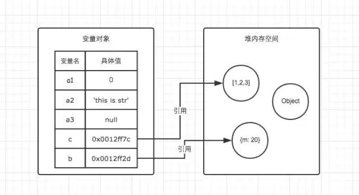

+ Js的引用数据类型,比如数组Array,它们的值得大小是不固定的.引用数据类型的值是保存在堆内存中的对象.JavaScript不允许直接访问堆内存中的位置,因此我们不能直接操作对象的堆内存空间.
+ 在操作对象时,实际上是在操作对象的引用而不是实际的对象.因此,引用类型的值都是按引用访问的.这里的引用,我们粗浅的理解为保存在变量对象的一个地址.该地址与堆内存的实际值相关联.
    - var b = {m:20};变量b存在栈内存中,对应的值就是一个索引指向堆内存中的{m:20},{m:20}作为对象存在于堆内存中.
    - 因此当我们要访问堆内存中的引用数据内型时,实际上我们首先是从变量对象中获取该对象的地址引用(或者地址指针),然后再从堆内存中取得我们需要的数据。