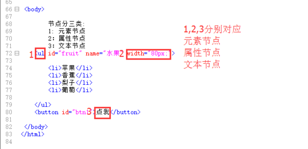

## 元素节点 属性节点 文本节点 文档节点 分别是什么意思？
> 节点是构成我们网页的最基本的组成部分，网页中的每一个部分都可以称为是一个节点
+ DOM是hmtl节点的一种规划方式,三种节点如下图
+ 
1. 元素节点:一般是拥有一对开闭合标签的元素整体 例如<ul></ul>这一部分属于元素节点
2. 属性节点一般是元素节点的属性,比如宽度属性.
3. 文本节点:DOM中用于呈现文本的部分.如上图中的'点我'儿子.一般被包含在元素节点的开闭合标签内部
4. 节点最终是要映射成为 js 对象，程序员操作这些对象来改变网页