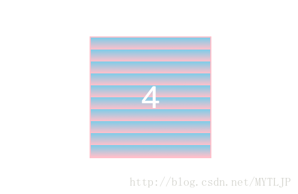
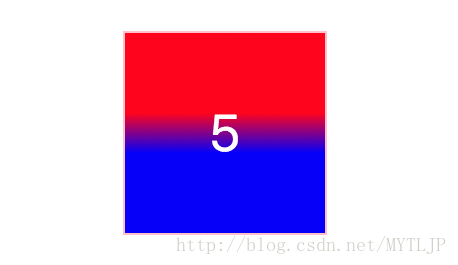
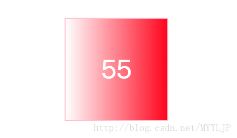

## 渐变

>CSS3 渐变（gradients）可以让你在两个或多个指定的颜色之间显示平稳的过渡.分为线性渐变(linear-gradient)、径向渐变(radial-gradient).
>linear-gradient
+ 创建线性渐变至少需要定义两个颜色,这个颜色就是你向呈现的的平稳过渡的颜色,同时也可以设置一个起点和一个方向,(或者一个角度)
+ 语法: background: linear-gradient(direction,color1,color2...)
1. 默认情况下,从上到下.
    - webkit 谷歌
    - o operal
    - moz firefox
    - ms IE
+ webkit情况注意一下,假如默认情况下是to left,如果想要达到相同的效果,这里需要写right,否则渐变方向相反.
+ 这里需要注意一下,默认写法需要加to,而加浏览器前缀后,不用加to.\
+ 可以写对角.可以写角度
+ 线性渐变--重复/平铺
    - reapeating-linear-gradient()函数 用于重复性渐变.
+ 注：平铺/重复的角度webkit和默认写法也有一些区别:默认写法的0deg是从上到下的，但是webkit的需要旋转90deg才是. 
+  下面的实例演示了从左上角开始（到右下角）的线性渐变。起点是红色，慢慢过渡到粉色，再到天蓝色: 
```
div{ 
background:repeating-linear-gradient(0deg,pink20px,skyblue40px); 
background:-webkit-repeating-linear-gradient(90deg,pink20px,skyblue40px); 
background:-o-repeating-linear-gradient(0deg,pink20px,skyblue40px); 
background:-moz-repeating-linear-gradient(0deg,pink20px,skyblue40px); 
background:-ms-repeating-linear-gradient(0deg,pink 20px,skyblue 40px); 
} 
```
注：这个平铺个数的算法是（div的总高度/40-20） 
我这里div的高度是200px，所以平铺的个数为200/20=10个 
效果图如下： 

+ 线性渐变 控制渐变的区域范围
    - 下面的实例演示了从80px开始到120px的线性渐变.渐变区域是120-80=40px,这里是颜色明显的红色和蓝色.以突出那渐变的40px;
    .
+ 线性渐变—透明度的使用 
+ CSS3 渐变也支持透明度（transparency），可用于创建减弱变淡的效果。 
+ 为了添加透明度，我们使用 rgba() 函数来定义颜色结点。 
+ rgba() 函数中的最后一个参数可以是从 0 到 1 的值，它定义了颜色的透明度：0 表示完全透明，1 表示完全不透明。 
下面的实例演示了从左边开始的线性渐变。起点是完全透明，慢慢过渡到完全不透明的红色;

