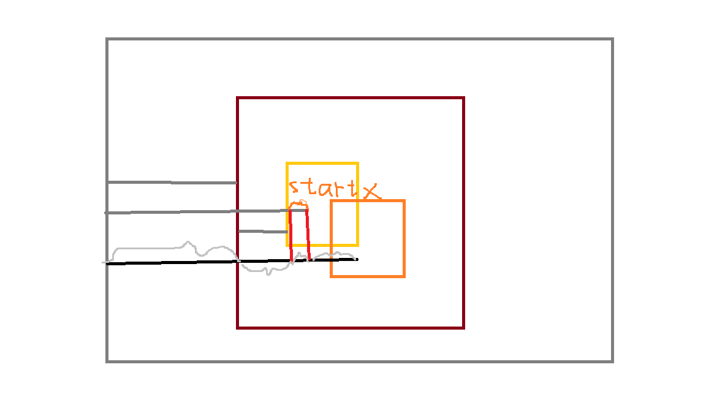

+ 思考几个问题
    - 如何让小方块在指定div框里移动?

+ 当鼠标点上去的时候,鼠标距离视口的宽度pageX-大盒子的距离视口的距离再减去小盒子距离视口的距离.等于偏移的距离.
+ 当鼠标开始移动的时候,偏移的的距离等于起始的小盒子距离大方块的近距离加上+后来偏移的距离
也就是 位移后鼠标的距离减去大盒子距离视口的距离再减去偏移量.
+ 此时在计算一个当前小盒子的距离大盒子的距离.
+ 如果当前小盒子距离大盒子的距离大于大盒子减去小盒子的宽度,则小盒子距离大盒子的距离等于大盒子减去小盒子的距离.
+ 如果当前小盒子距离大盒子的距离小于0,则,距离等于0>

+ 问题二:如何在小盒子里移动的同时,在镜像里移动,并且具有放大效果?
    - 先获取镜像框与移动的小方块之间的比列关系,根据比列关系通过js重置镜像的图片大小,用比列乘以100%
    - 最后获取镜像的距离边框的距离, 乘以比例.就是镜像图片的位置.

